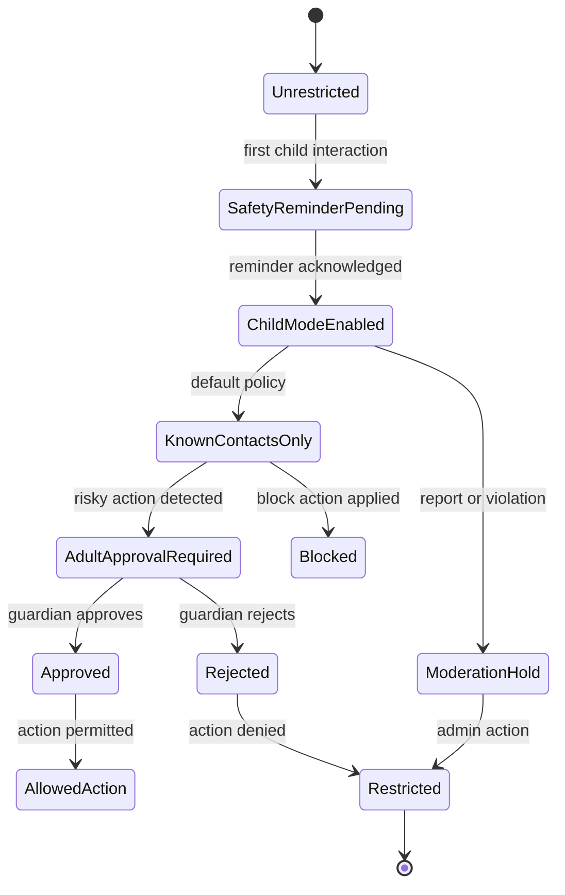
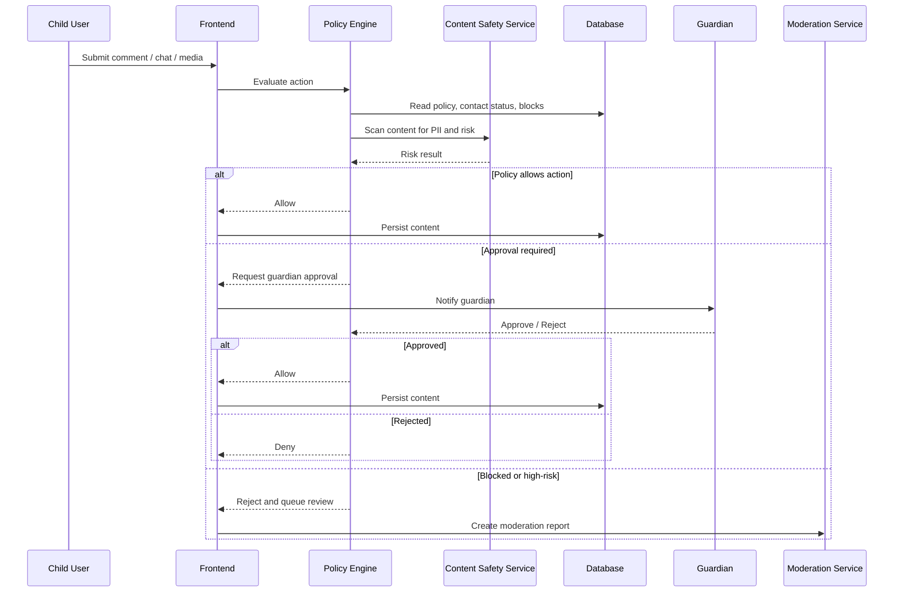
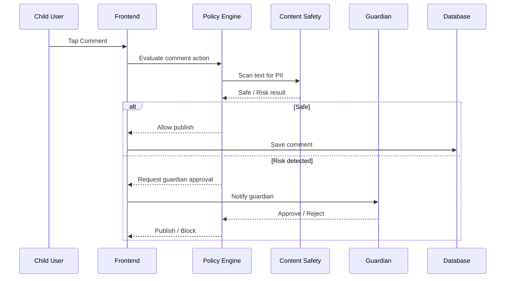
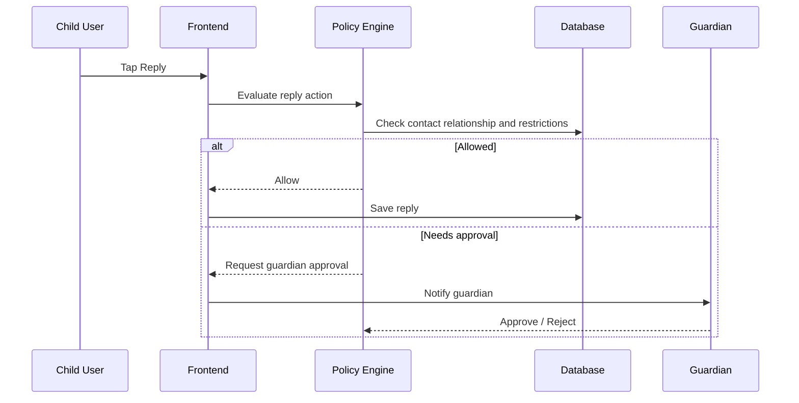
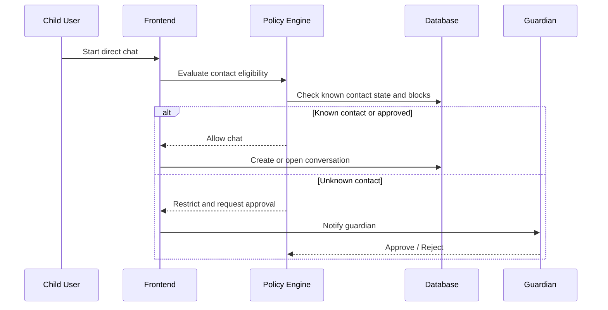
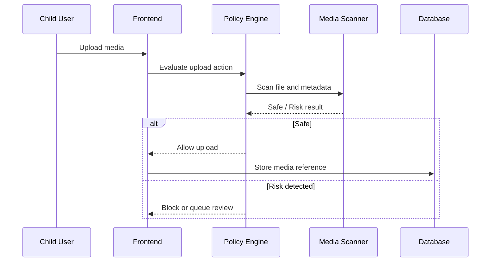
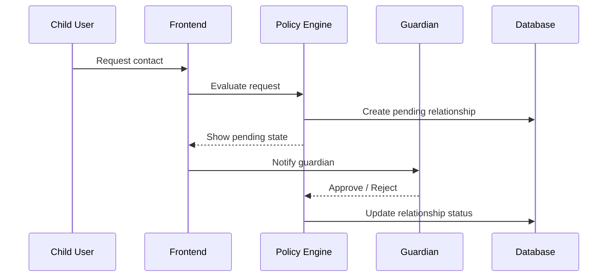
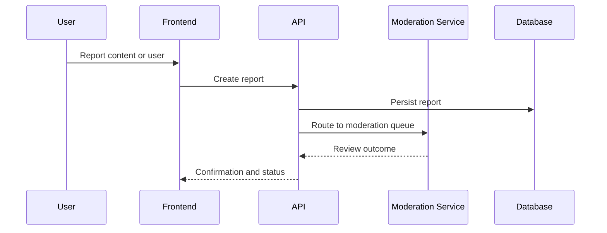
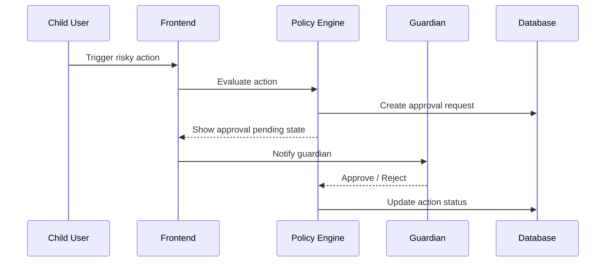
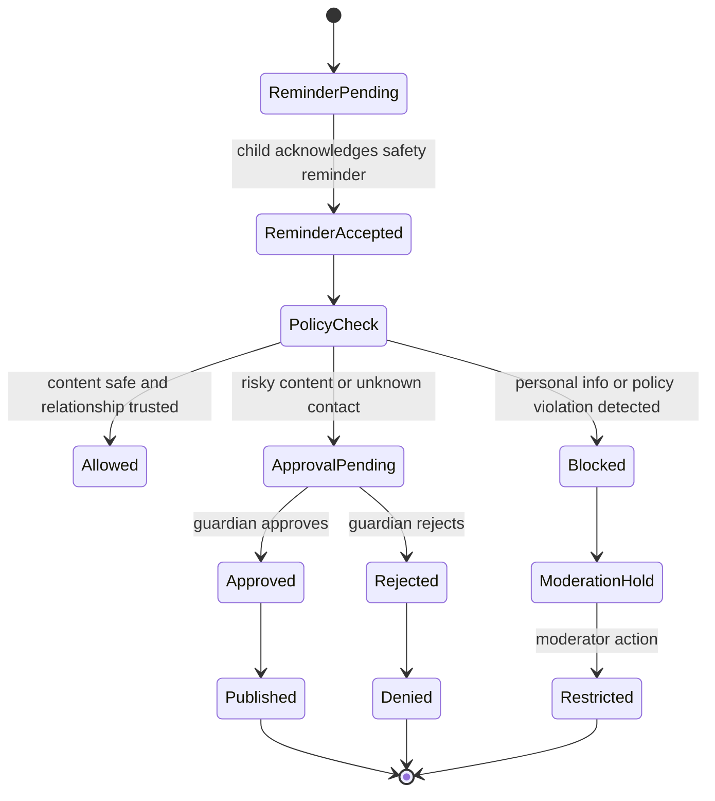

# Child Safety System Design

## 1. Purpose

This document defines a complete child safety system for the app’s social features, including comments, replies, chat-like conversations, media upload, and user profiles. The design is intended to support Google Play Families Policy compliance while preserving a safe and useful social experience for families.

## 2. Goals

- Protect child accounts from unsafe contact and content.
- Prevent sharing of personal information and location data.
- Provide guardian oversight for sensitive interactions.
- Make social interactions safe by default.
- Create a moderation and audit trail suitable for policy review and enforcement.
- Avoid “quick fix” behavior by using a layered policy engine, access control, content scanning, moderation, and audit logging.

## 3. Compliance Principles

The system is built around the following Google Play Families Policy-aligned principles:

- Child accounts default to restricted social features.
- Children cannot interact with unknown users by default.
- High-risk actions require guardian approval.
- Unsafe content is blocked or routed to review.
- Users can report and block other users.
- All enforcement actions are logged for auditability.
- The system is designed for age-appropriate, not unrestricted, social behavior.

## 4. System Scope

### In Scope

- Online safety reminder
- Child mode
- Adult approval workflow
- Known contacts only
- Report user
- Block user
- Personal information detection
- Moderation queue and review
- Audit logging
- Policy enforcement across comments, replies, direct chat, media upload, and profile interactions

### Out of Scope

- Full AI moderation model training
- Public social graph discovery for child accounts
- Unmoderated user-generated content feeds for minors

## 5. Core Architecture

### 5.1 Components

- Frontend Policy Gate
  - Enforces safe UX in the app before requests are sent.
  - Shows reminder dialogs, approval requests, and blocked-state messaging.

- Policy Engine
  - Central service that evaluates whether an action is allowed.
  - Uses account age, mode, relationship status, content risk, guardian approvals, and moderation state.

- Relationship Service
  - Tracks known contacts, guardian relationships, block state, and pending approvals.

- Content Safety Service
  - Scans text, media captions, and media metadata for personal information and risky content.

- Moderation Service
  - Routes flagged content to review queues and applies actions.

- Audit Log Service
  - Records all policy decisions and enforcement actions.

- Notification Service
  - Sends approval requests, moderation alerts, and safety reminder prompts.

## 6. Policy Model

### 6.1 Account Modes

- Child Mode Enabled
  - Default for accounts identified as minors.
  - Restricts interactions to safe, known-contact flows.

- Known Contacts Only
  - A child may interact only with users who are approved contacts or users already linked through a trusted context such as a shared trip or existing conversation.

- Adult Approval Required
  - Higher-risk actions such as chat initiation, profile viewing, media upload, or public comments require guardian approval.

- Restricted / Moderation Hold
  - Applied when an account is under review or has been warned or suspended.

### 6.2 Risk Levels

- Low: plain comments, non-sensitive replies
- Medium: direct chat, profile interaction, media upload
- High: contact request, location sharing, public profile discovery, photo upload with visible personal details

## 7. Database Schema

### 7.1 Accounts and Profile Policy State

```sql
create table child_safety_policies (
  id uuid primary key default gen_random_uuid(),
  user_id uuid not null unique references profiles(id) on delete cascade,
  mode text not null default 'child_mode',
  known_contacts_only boolean not null default true,
  adult_approval_required boolean not null default true,
  safety_reminder_version text not null,
  safety_reminder_acknowledged_at timestamptz,
  guardian_id uuid references profiles(id),
  guardian_consented_at timestamptz,
  restrictions_applied jsonb not null default '{}',
  created_at timestamptz not null default now(),
  updated_at timestamptz not null default now()
);
```

### 7.2 Known Contacts and Relationships

```sql
create table child_safety_contacts (
  id uuid primary key default gen_random_uuid(),
  child_user_id uuid not null references profiles(id) on delete cascade,
  other_user_id uuid not null references profiles(id) on delete cascade,
  relationship_status text not null default 'pending',
  source text not null,
  approved_by_guardian_id uuid references profiles(id),
  approved_at timestamptz,
  revoked_at timestamptz,
  last_verified_at timestamptz,
  metadata jsonb not null default '{}',
  created_at timestamptz not null default now(),
  updated_at timestamptz not null default now(),
  unique(child_user_id, other_user_id)
);
```

### 7.3 Adult Approval Requests

```sql
create table child_safety_approvals (
  id uuid primary key default gen_random_uuid(),
  child_user_id uuid not null references profiles(id) on delete cascade,
  requester_user_id uuid not null references profiles(id) on delete cascade,
  guardian_id uuid references profiles(id),
  action_type text not null,
  action_target_type text not null,
  action_target_id uuid,
  request_reason text,
  status text not null default 'pending',
  requested_at timestamptz not null default now(),
  reviewed_at timestamptz,
  expires_at timestamptz,
  decision_notes text,
  metadata jsonb not null default '{}'
);
```

### 7.4 Blocks

```sql
create table user_blocks (
  id uuid primary key default gen_random_uuid(),
  blocker_user_id uuid not null references profiles(id) on delete cascade,
  blocked_user_id uuid not null references profiles(id) on delete cascade,
  scope text not null default 'all',
  reason text,
  created_at timestamptz not null default now(),
  unique(blocker_user_id, blocked_user_id)
);
```

### 7.5 Reports

```sql
create table moderation_reports (
  id uuid primary key default gen_random_uuid(),
  reporter_user_id uuid not null references profiles(id) on delete cascade,
  target_user_id uuid references profiles(id),
  target_type text not null,
  target_id uuid,
  report_reason text not null,
  severity text not null default 'medium',
  status text not null default 'open',
  evidence jsonb not null default '{}',
  reviewed_by uuid references profiles(id),
  reviewed_at timestamptz,
  resolution text,
  created_at timestamptz not null default now()
);
```

### 7.6 Content Risk Scans

```sql
create table content_safety_reviews (
  id uuid primary key default gen_random_uuid(),
  content_type text not null,
  content_id uuid not null,
  owner_user_id uuid references profiles(id),
  scan_status text not null default 'pending',
  risk_score integer not null default 0,
  pii_detected boolean not null default false,
  policy_flags jsonb not null default '[]',
  review_result text,
  reviewed_by uuid references profiles(id),
  created_at timestamptz not null default now(),
  updated_at timestamptz not null default now()
);
```

### 7.7 Audit Logs

```sql
create table child_safety_audit_logs (
  id uuid primary key default gen_random_uuid(),
  actor_user_id uuid references profiles(id),
  target_user_id uuid references profiles(id),
  event_type text not null,
  event_context jsonb not null default '{}',
  severity text not null default 'info',
  ip_hash text,
  user_agent_hash text,
  created_at timestamptz not null default now()
);
```

### 7.8 Recommended Indexes

- child_safety_policies(user_id)
- child_safety_contacts(child_user_id, relationship_status)
- child_safety_approvals(child_user_id, status, expires_at)
- moderation_reports(status, target_user_id)
- content_safety_reviews(scan_status, content_type, content_id)
- child_safety_audit_logs(actor_user_id, target_user_id, created_at)

## 8. API Endpoints

### 8.1 Policy and Mode

- GET /v1/child-safety/policies
  - Returns the active policy state for the current user.

- POST /v1/child-safety/reminder/ack
  - Records that the user acknowledged the safety reminder.

- POST /v1/child-safety/mode
  - Enables or updates child mode and related restrictions.

- POST /v1/child-safety/guardian-consent
  - Records guardian consent for child mode or approval flows.

### 8.2 Contacts and Relationships

- POST /v1/child-safety/contacts/request
  - Requests that a user be added as a known contact.

- POST /v1/child-safety/contacts/:id/approve
  - Guardian approves a known contact request.

- POST /v1/child-safety/contacts/:id/reject
  - Guardian rejects a contact request.

- DELETE /v1/child-safety/contacts/:id
  - Removes a contact relationship.

### 8.3 Approval Workflow

- POST /v1/child-safety/approvals
  - Creates a guardian approval request for a risky action.

- POST /v1/child-safety/approvals/:id/approve
  - Approves the request.

- POST /v1/child-safety/approvals/:id/reject
  - Rejects the request.

### 8.4 Reports and Blocks

- POST /v1/moderation/reports
  - Creates a report for a user, message, comment, reply, or media item.

- POST /v1/moderation/blocks
  - Creates a block relationship.

- DELETE /v1/moderation/blocks/:id
  - Removes a block.

### 8.5 Content Scanning

- POST /v1/content-safety/scan
  - Internal endpoint used before publishing content.

### 8.6 Moderation and Audit

- GET /v1/moderation/queue
  - Returns pending reports and flagged content.

- POST /v1/moderation/actions
  - Applies a moderation action such as warning, restrict, or suspend.

- GET /v1/audit-logs
  - Returns audit logs for a user or object.

## 9. Enforcement Rules

### 9.1 Commenting and Replies

- Public comments and replies are allowed only when the user is not under restriction.
- If the content contains personal information, the action is blocked and queued for review.
- If the user is a child and the receiver is not a known contact, the action is disallowed unless guardian approval exists.

### 9.2 Chat

- Direct chat is restricted for child accounts unless the other user is a known contact or has guardian approval.
- Messages with location data, school names, full names, or phone numbers are blocked.

### 9.3 Media Upload

- Media uploads require a scan for visible personal information and location metadata.
- Sensitive media is blocked or replaced with a redacted placeholder pending review.

### 9.4 Profile Visibility

- Public profile discovery is limited for child accounts.
- Profile details are minimized and restricted unless the viewer is a known contact or guardian-approved.

## 10. State Diagram



## 11. Sequence Diagram



## 12. Permissions Model

| Role | Permissions |
|---|---|
| Child user | View approved content, send safe content, request guardian approval, report or block users |
| Guardian | Manage child policy, approve/reject requests, view audit logs, override restrictions |
| Moderator | Review reports, apply warnings, restrict accounts, resolve safety issues |
| Admin | Full moderation and policy configuration access |
| System | Run scanning, write audit logs, enforce decisions |

## 13. User Flows

### 13.1 First-Time Child Safety Setup

1. Child creates account.
2. The system detects minor age based on profile data.
3. Child mode is enabled by default.
4. The app shows the online safety reminder.
5. The child must acknowledge the reminder before publishing social content.

### 13.2 Known Contact Interaction

1. Child requests to contact another user.
2. The system checks whether the user is already a known contact.
3. If not, a guardian approval request is created.
4. The guardian approves or rejects.
5. Only approved contacts can engage in direct chat or profile interaction.

### 13.3 Reporting and Blocking

1. User taps Report or Block.
2. The action creates a report or block record.
3. The system prevents future contact and logs the event.
4. Escalation to moderation occurs for severe or repeated violations.

### 13.4 Media Upload Protection

1. Child uploads a photo or media file.
2. The system scans the media and metadata.
3. If location or personal information is detected, the upload is blocked or sent for review.
4. The child receives a safe explanation and guidance.

## 14. Screen Flows and UX Specifications

### 14.1 Comment Flow

```text
Child taps Comment
↓
Online Safety Reminder
↓
"I Understand"
↓
Comment Composer
↓
Content Scan
↓
Contains phone number or address?
↓
Yes
↓
Adult Approval Required
↓
Parent Approves
↓
Comment Published
```

### 14.2 Screen Mockups

#### Safety Reminder

```text
────────────────────────
Stay Safe Online

Remember:
• Only talk to people you know.
• Never share your address.
• Never share your phone number.
• Tell an adult if something feels wrong.

[I Understand]
────────────────────────
```

#### Adult Approval Required

```text
────────────────────────
Adult Approval Required

This message contains
personal information.

Ask your parent
before sending it.

[Request Approval]
────────────────────────
```

#### Blocked Content

```text
────────────────────────
We couldn't send this.

It looks like your message
contains personal information.

Please remove it or ask
a parent for approval.

[Edit Message]
────────────────────────
```

#### Guardian Approval Notification

```text
────────────────────────
Approval Request

Your child wants to send
this message to a new contact.

[Approve]   [Reject]
────────────────────────
```

### 14.3 Feature-Specific UX Flows

- Comment Flow
  1. User opens comment composer.
  2. Safety reminder appears once per session or per policy version.
  3. Content is scanned.
  4. If safe, publish immediately.
  5. If sensitive, escalate to guardian approval or block.

- Reply Flow
  1. User taps Reply.
  2. The app checks whether the reply target is a known contact or approved connection.
  3. If the reply includes personal information, approval is requested.
  4. If approved, the reply is posted.

- Chat Flow
  1. User opens a direct chat.
  2. The system checks whether the other user is a known contact.
  3. If not, the app shows a restricted state and requests approval.
  4. If approved, chat opens.
  5. Messages are scanned in real time.

- Media Upload Flow
  1. User selects photo or video.
  2. Media is scanned for visible faces, text, geotags, and metadata.
  3. If risk is detected, the upload is blocked or queued for review.
  4. If safe, the upload is published.

- Friend Request / Contact Request Flow
  1. Child taps Add Contact.
  2. Request enters pending state.
  3. Guardian receives approval request.
  4. Guardian approves or rejects.
  5. Approved contact becomes known contact.

- Report Flow
  1. User taps Report.
  2. Report reason and evidence are captured.
  3. The report is sent to moderation.
  4. The reporter receives confirmation.
  5. The target may receive a restriction if the report is validated.

- Guardian Approval Flow
  1. Child action triggers approval request.
  2. Guardian sees an in-app notification and email/push alert.
  3. Guardian reviews message, media, or contact details.
  4. Guardian approves or rejects.
  5. The app publishes or blocks the action.

## 15. Decision Matrix

| Action | Child | Teen | Adult | Notes |
|---|---|---|---|---|
| Comment | Allowed with reminder and safe content | Allowed | Allowed | Child comments may require approval if risky |
| Reply | Allowed with reminder and known-contact check | Allowed | Allowed | Reply to unknown user is restricted for child accounts |
| DM unknown user | Restricted / approval required | Allowed with safeguards | Allowed | Child accounts default to known contacts only |
| Send phone number | Blocked or approval required | Warning / moderation | Allowed | High sensitivity |
| Upload photo | Scan required | Allowed with checks | Allowed | Must not contain personal details or geotags |
| Share location | Blocked or approval required | Warning / moderation | Allowed | High-risk action |
| Report user | Allowed | Allowed | Allowed | Must be logged and routed to moderation |
| Block user | Allowed | Allowed | Allowed | Must prevent future contact |

## 16. Feature-Specific Sequences

### 16.1 Comment Sequence



### 16.2 Reply Sequence



### 16.3 Chat Sequence



### 16.4 Media Upload Sequence



### 16.5 Contact Request Sequence



### 16.6 Report Sequence



### 16.7 Guardian Approval Sequence



## 17. API Permissions Matrix

| Endpoint | Child | Guardian | Moderator | Admin |
|---|---|---|---|---|
| POST /comments | Yes, if policy allows | Yes | Yes | Yes |
| POST /replies | Yes, if policy allows | Yes | Yes | Yes |
| POST /chat | Known contacts only by default | Yes | Yes | Yes |
| POST /guardian/approve | No | Yes | No | Yes |
| POST /moderation/report | Yes | Yes | Yes | Yes |
| POST /moderation/block | Yes | Yes | Yes | Yes |
| GET /moderation/queue | No | No | Yes | Yes |
| POST /moderation/actions | No | No | Yes | Yes |
| GET /audit-logs | Self only, or guardian-approved | Yes for child account | Yes | Yes |

## 18. State Machine



## 19. Moderation Flow

1. Content or user activity is flagged.
2. The system creates a moderation report with evidence.
3. The queue routes the case based on severity.
4. A moderator reviews and chooses one of the following:
   - Dismiss
   - Warning
   - Temporary restriction
   - Permanent restriction
   - Account suspension
5. Every decision is written to the audit log.

## 20. Security Implications

- Policy checks must be enforced on the server, not only in the frontend.
- The system must prevent bypass through direct API calls or manipulated clients.
- Audit logs must be append-only and tamper-evident.
- PII scanning should be treated as sensitive processing and should not expose raw content to unauthorized roles.
- Guardian approvals must be bound to the child’s account and require authenticated guardian identity.
- All moderation events should be rate-limited and protected against abuse.

## 21. Edge Cases

- Guardian account is unavailable or not linked.
- Child account changes age category.
- Existing direct chats with unknown users must be evaluated against the new policy.
- False-positive PII detection on travel content or public landmarks.
- Repeated submission of blocked content after a warning.
- Report from a child that conflicts with a previous block or approval.
- Media file contains hidden metadata with location data.
- A user is blocked by one party but not the other.
- The child is interacting in a shared trip context where the relationship is trusted but not previously approved.

## 22. Failure Cases and Resilience

### 22.1 Policy Engine Unavailable

- Fail closed: deny risky actions and show a safe fallback message.
- Queue the request for later review if the action is not immediately critical.

### 22.2 Content Scan Service Down

- Do not allow high-risk actions without review.
- Place content in a moderation hold state.

### 22.3 Guardian Approval Not Responded To

- Requests expire after a defined window.
- The action remains blocked until approval or rejection.

### 22.4 Network Failure

- User sees a clear “please try again” message.
- The system avoids partial success states.

### 22.5 False Positive Detection

- Allow manual review by a moderator.
- Maintain an appeal or override path for legitimate content.

## 23. Operational Notes

- The policy engine should be the single source of truth for all social feature decisions.
- Frontend should only provide UX guardrails, not security enforcement.
- Every decision should be logged with actor, target, reason, and outcome.
- Data retention for moderation and audit logs should follow product and legal policy requirements.

## 24. Implementation Order

### Sprint 1
- Child mode
- DOB detection
- Safety reminder

### Sprint 2
- Policy engine
- Middleware and API guards
- Basic server-side enforcement for comments and chat

### Sprint 3
- Known contacts model
- Relationship verification

### Sprint 4
- Guardian approval workflow
- Approval notifications

### Sprint 5
- PII detection for text and captions
- Basic moderation queue

### Sprint 6
- Report and block flows
- User-facing restriction states

### Sprint 7
- Media metadata scanning
- Review queue refinement

### Sprint 8
- Audit logs
- QA and compliance review

## 25. Recommended Implementation Phases

### Phase 1
- Safety reminder
- Child mode defaults
- Basic block/reporting
- Server-side enforcement for comments and chat

### Phase 2
- Guardian approval workflow
- Known-contact model
- PII detection on text and captions

### Phase 3
- Advanced moderation queue
- Media metadata scanning
- Full audit dashboards and export tools

## 26. Summary

This design replaces unrestricted social interaction with a layered child-safe system that is enforceable, auditable, and suitable for Google Play Families Policy compliance. The architecture prioritizes safety by default, guardian oversight, transparent moderation, and strong server-side enforcement.
